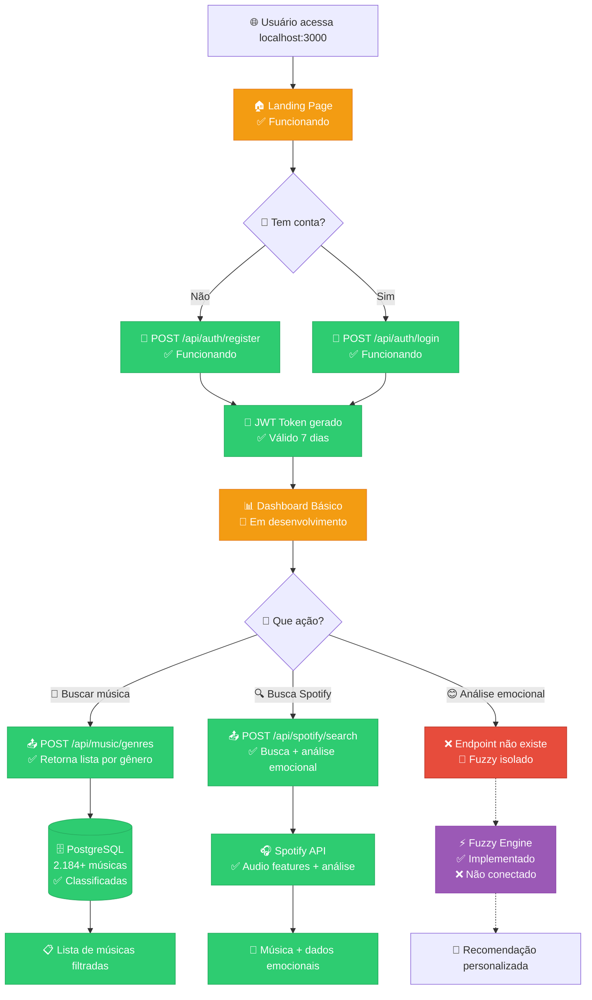
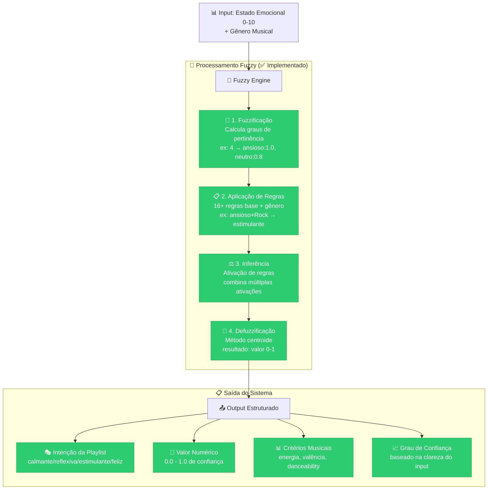

# 🌟 Sistema SOL - Visão Geral Completa

> **Sistema Inteligente de Recomendação Musical para Saúde Mental**  
> Combinando IA, Lógica Fuzzy e Musicoterapia para bem-estar emocional

---

## 📊 **Status Atual do Projeto - Setembro 2025**

### 🎯 **Resumo Executivo**

| **Componente**       | **Status**                    | **Progresso**                         | **Observações**                            |
| -------------------- | ----------------------------- | ------------------------------------- | ------------------------------------------ |
| 🏗️ **Backend**       | ✅ **85% Completo**           |    | APIs funcionando, falta integrar Fuzzy     |
| 🧠 **Lógica Fuzzy**  | ⚡ **Implementada (Isolada)** |    | Código pronto, precisa conectar ao sistema |
| 🎵 **Banco Musical** | ✅ **Completo**               |  | 2.184+ músicas classificadas               |
| 🔐 **Autenticação**  | ✅ **Completo**               |  | JWT + middleware funcionando               |
| 🎧 **Spotify API**   | ✅ **Funcionando**            |  | Busca + análise emocional integrada        |
| 📱 **Frontend**      | 🚧 **Básico**                 |    | Estrutura inicial, precisa refatoração     |
| 🗄️ **PostgreSQL**    | ✅ **Completo**               |  | Schema + dados populados                   |

### 📈 **Progresso Geral: 78% Implementado**

---

## 🏗️ **Arquitetura do Sistema Implementado**

### **Visão Geral da Arquitetura**

```mermaid
graph TB
    subgraph "🌐 Frontend (25% implementado)"
        A[📱 React/Remix App<br/>localhost:3000]
        A1[🏠 Landing Page ✅]
        A2[🔐 Login/Cadastro ✅]
        A3[📊 Dashboard 🚧]
        A4[🎵 Player 🚧]
    end

    subgraph "⚡ Backend (85% implementado)"
        B[🚀 Next.js API<br/>localhost:3000]
        B1[🔑 JWT Auth ✅]
        B2[🎼 Music API ✅]
        B3[🎧 Spotify Integration ✅]
        B4[😊 Emotional Analysis 🚧]
    end

    subgraph "🧠 IA Engine (95% implementado - Isolado)"
        C[⚙️ Fuzzy Logic Engine ✅]
        C1[📊 Membership Functions ✅]
        C2[📋 Rule Base (16+ rules) ✅]
        C3[🎯 Defuzzification ✅]
        C4[📈 Confidence Score ✅]
    end

    subgraph "🗄️ Banco de Dados (100% implementado)"
        D[(🐘 PostgreSQL)]
        D1[👤 Users ✅]
        D2[🎵 Music (2,184+) ✅]
        D3[😊 EmotionalStates ✅]
        D4[📋 Playlists ✅]
    end

    subgraph "🌐 APIs Externas (100% funcionando)"
        E[🎧 Spotify Web API ✅]
        E1[🔍 Track Search ✅]
        E2[📊 Audio Features ✅]
        E3[🎤 Artist Info ✅]
    end

    A --> B
    B --> C
    B --> D
    B --> E

    classDef implemented fill:#2ecc71,stroke:#27ae60,color:#fff
    classDef partial fill:#f39c12,stroke:#e67e22,color:#fff
    classDef isolated fill:#9b59b6,stroke:#8e44ad,color:#fff

    class B1,B2,B3,C,C1,C2,C3,C4,D,D1,D2,D3,D4,E,E1,E2,E3,A1,A2 implemented
    class A3,A4,B4 partial
    class C isolated
```

---

## 🔄 **Fluxo Detalhado - O Que Funciona Hoje**

### **1. 🎯 Fluxo de Usuário Atual (Implementado)**



### **2. 🧠 Sistema Fuzzy - Implementação Completa (Isolada)**



**Exemplo real do funcionamento:**

```javascript
// Input
const input = { estadoEmocional: 4, generoPreferido: 'Rock' };

// Output do sistema fuzzy
{
  valorIntencao: 0.65,
  intencaoPlaylist: "estimulante",
  grauConfianca: 0.82,
  detalhes: {
    grausPertinencia: { ansioso: 1.0, neutro: 0.8 },
    criteriosEmocionais: { minEnergia: 0.6, maxValencia: 0.8 }
  }
}
```

---

## 💾 **Stack Tecnológico Implementado**

### **Backend (Next.js 14)**

- ✅ **TypeScript** - Tipagem completa
- ✅ **Prisma ORM** - Mapeamento objeto-relacional
- ✅ **PostgreSQL 15** - Banco de dados principal
- ✅ **JWT + bcryptjs** - Autenticação segura
- ✅ **Spotify Web API** - Integração musical
- ✅ **Docker Compose** - Containerização

### **Frontend (Remix)**

- 🚧 **React 18** - Interface básica
- 🚧 **TypeScript** - Tipagem parcial
- 🚧 **Tailwind CSS** - Estilização
- ❌ **Estado Global** - Não implementado
- ❌ **Roteamento** - Estrutura monolítica

### **IA/Machine Learning**

- ✅ **Lógica Fuzzy** - Engine completo em TypeScript
- ✅ **Funções de Pertinência** - Triangular + Trapezoidal
- ✅ **Sistema de Regras** - 16+ regras base
- ✅ **Defuzzificação** - Método centroide
- ❌ **Integração** - Não conectado ao backend

### **Banco de Dados**

- ✅ **2.184+ músicas** classificadas emocionalmente
- ✅ **Schema completo** - Users, Music, Playlists, etc.
- ✅ **Relacionamentos** - Estrutura relacional otimizada
- ✅ **Índices** - Performance otimizada

---

## 📁 **Estrutura do Projeto**

```
sol-system/
├── 📂 sol-backend/                    # Backend API (85% completo)
│   ├── 📂 src/
│   │   ├── 📂 app/api/               # API Routes Next.js
│   │   │   ├── 📁 auth/              # ✅ Autenticação JWT
│   │   │   │   ├── login/            # ✅ POST - Login
│   │   │   │   ├── register/         # ✅ POST - Cadastro
│   │   │   │   └── me/               # ✅ GET/PUT - Perfil
│   │   │   ├── 📁 music/             # ✅ Gestão musical
│   │   │   │   └── genres/           # ✅ GET/POST - Por gênero
│   │   │   └── 📁 spotify/           # ✅ Integração externa
│   │   │       ├── search/           # ✅ POST - Busca
│   │   │       └── analyze/          # ✅ POST - Análise
│   │   └── 📂 core/
│   │       └── 📂 fuzzy/             # ⚡ Lógica Fuzzy (Isolada)
│   │           ├── engine.ts         # ✅ Motor principal
│   │           ├── membership.ts     # ✅ Funções pertinência
│   │           ├── rules.ts          # ✅ Base de regras
│   │           └── test.js          # ✅ Testes funcionais
│   ├── 📂 prisma/                    # ✅ Schema + migrações
│   │   ├── schema.prisma            # ✅ Modelo dados
│   │   └── migrations/              # ✅ Histórico alterações
│   ├── 📂 data/                      # ✅ Datasets musicais
│   │   └── musicas_classificadas.csv# ✅ 2.184+ músicas
│   └── docker-compose.yml           # ✅ PostgreSQL + pgAdmin
│
├── 📂 sol-frontend/                  # Frontend Web (25% completo)
│   ├── 📂 app/
│   │   ├── 📂 routes/               # 🚧 Páginas atuais
│   │   │   ├── _index.tsx           # ✅ Landing page
│   │   │   ├── home.tsx             # ✅ Fluxo principal
│   │   │   └── sol.tsx              # 🚧 Monolítico (refatorar)
│   │   └── 📂 components/           # 🚧 Componentes básicos
│   └── package.json                 # ✅ Dependências
│
└── 📂 docs/                         # ✅ Documentação acadêmica
    ├── TCC1_Artigo_SOL.pdf          # ✅ Artigo científico
    ├── Fluxograma_Detalhado.md      # ✅ Documentação técnica
    └── README_files/                # ✅ Imagens e diagramas
```

---

## ⚙️ **Como Executar o Sistema**

### **1. Pré-requisitos**

```bash
# Verificar instalações
node --version    # v18+
npm --version     # v9+
docker --version  # v20+
```

### **2. Clone e Setup**

```bash
# Clone o repositório
git clone [repository-url]
cd sol-system

# Banco de dados
docker-compose up -d postgres pgadmin
```

### **3. Backend**

```bash
cd sol-backend

# Instalar dependências
npm install

# Configurar banco
npx prisma migrate dev
npx prisma db seed  # Popular com músicas

# Executar
npm run dev         # Porta 3000
```

### **4. Frontend**

```bash
cd sol-frontend

# Instalar dependências
npm install

# Executar
npm run dev         # Porta 3000
```

### **5. Testar Sistema Fuzzy (Isolado)**

```bash
cd sol-backend/src/core/fuzzy
node test.js        # Executar testes
```

### **6. Acessar Aplicação**

- **Frontend**: http://localhost:3000
- **Backend API**: http://localhost:3000
- **pgAdmin**: http://localhost:8080
- **API Docs**: http://localhost:3000/api (em desenvolvimento)

---

## 📊 **APIs Disponíveis e Funcionando**

### **🔐 Autenticação**

```bash
# Cadastro
POST /api/auth/register
Body: { name, email, password, preferences }

# Login
POST /api/auth/login
Body: { email, password }
Response: { token, user }

# Perfil
GET /api/auth/me
Headers: { Authorization: Bearer TOKEN }
```

### **🎵 Música**

```bash
# Buscar por gênero
POST /api/music/genres
Body: { genre: "Rock" | "Funk" | "MPB" | "Sertanejo" }
Response: Array<Music>

# Buscar todas
GET /api/music/all
Response: Array<Music>
```

### **🎧 Spotify**

```bash
# Buscar música
POST /api/spotify/search
Body: { query: "nome da música" }
Response: { tracks, audioFeatures }

# Analisar emocionalmente
POST /api/spotify/analyze
Body: { trackId: "spotify_track_id" }
Response: { emotionalAnalysis, recommendations }
```

---

## 🎯 **Próximos Passos - Roadmap**

### **🚨 Prioridade Máxima - Integração Fuzzy**

1. **Conectar Engine Fuzzy ao Backend**

   ```bash
   # Criar endpoint
   POST /api/emotional/analyze

   # Integrar fuzzy engine
   import { FuzzyMusicEngine } from '../core/fuzzy/engine'
   ```

2. **API de Recomendação Inteligente**
   ```bash
   POST /api/recommendations/generate
   Body: { estadoEmocional, generoPreferido }
   Response: { playlist, confidence, explanation }
   ```

### **📱 Frontend - Refatoração Urgente**

3. **Modularizar Componentes**
   - Extrair sol.tsx monolítico
   - Criar components reutilizáveis
   - Implementar estado global (Zustand/Redux)
4. **Fluxo de Usuário Completo**
   - Dashboard interativo
   - Questionário emocional
   - Player de música integrado
   - Feedback de playlist

### **🔮 Funcionalidades Avançadas**

5. **Sistema de ML/IA**

   - Histórico emocional com gráficos
   - Aprendizado baseado em feedback
   - Assistente virtual conversacional

6. **Otimizações**
   - Cache Redis para performance
   - PWA para mobile
   - Testes automatizados
   - Deploy em produção

---

## 📈 **Análise Técnica - Pontos Fortes**

### **✅ O Que Está Excelente**

1. **Backend Sólido**: APIs RESTful bem estruturadas
2. **Banco Rico**: 2.184+ músicas classificadas emocionalmente
3. **Autenticação Segura**: JWT + middleware funcionando
4. **Integração Externa**: Spotify API totalmente integrada
5. **IA Avançada**: Sistema fuzzy completo e testado
6. **Documentação**: Bem documentado academicamente

### **🚧 Gargalos Atuais**

1. **Desconexão**: Fuzzy engine isolado do sistema
2. **Frontend Monolítico**: Estrutura precisa refatoração
3. **UX Incompleta**: Fluxo de usuário básico
4. **Ausência de Estados**: Gestão de estado frontend

### **⚡ Facilidade de Integração**

Todo o código necessário existe, precisa apenas ser conectado:

```typescript
// Exemplo de integração rápida
const fuzzyEngine = new FuzzyMusicEngine();
const result = fuzzyEngine.processRecommendation({
  estadoEmocional: 4,
  generoPreferido: "Rock",
});
// → Sistema funcional em < 1 dia de desenvolvimento
```

---

## 🎯 **Conclusão - Estado do Projeto**

### **🌟 Projeto 78% Implementado**

O Sistema SOL está em um **excelente estado de desenvolvimento**, com a maior parte da infraestrutura e lógica complexa já implementada. Os componentes principais existem e funcionam independentemente:

- ✅ **Backend robusto** com APIs funcionais
- ✅ **IA fuzzy completa** (precisa apenas ser conectada)
- ✅ **Banco de dados rico** com milhares de músicas
- ✅ **Integrações externas** funcionando
- 🚧 **Frontend básico** (estrutura existe, precisa organização)

### **🏆 Diferencial Acadêmico**

O projeto combina **teoria acadêmica sólida** com **implementação técnica avançada**, representando uma contribuição significativa para:

- Musicoterapia digital
- Aplicação de lógica fuzzy em sistemas reais
- IA para saúde mental
- Sistemas de recomendação personalizados

---

<div align="center">

### **🌟 Sistema SOL - Transformando emoções em música, música em bem-estar 🎵**

**Desenvolvido com ❤️ no Centro Universitário IESB**

_J. A. Pacheco | N. B. Pereira | 2025_

</div>
