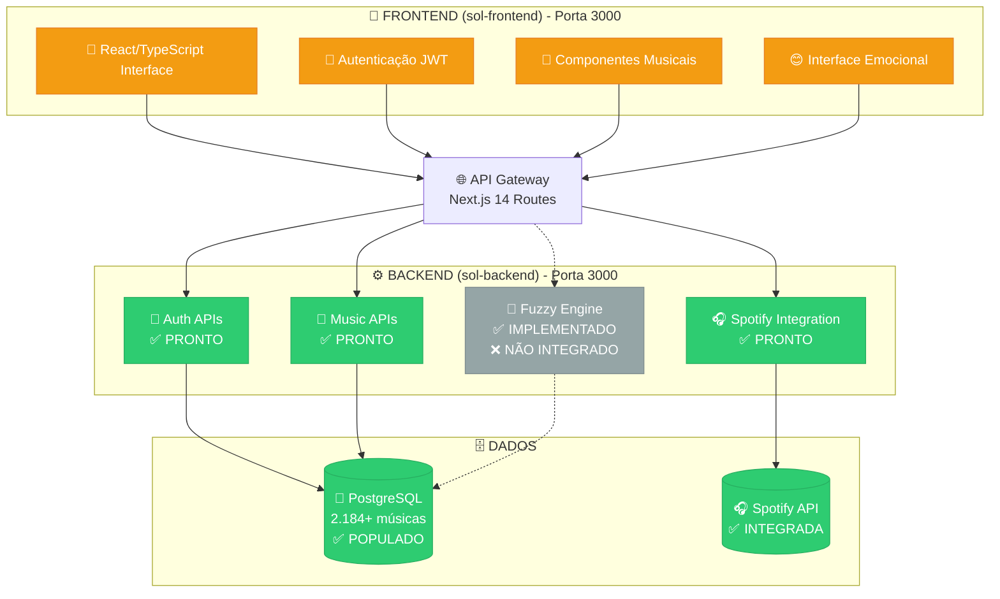
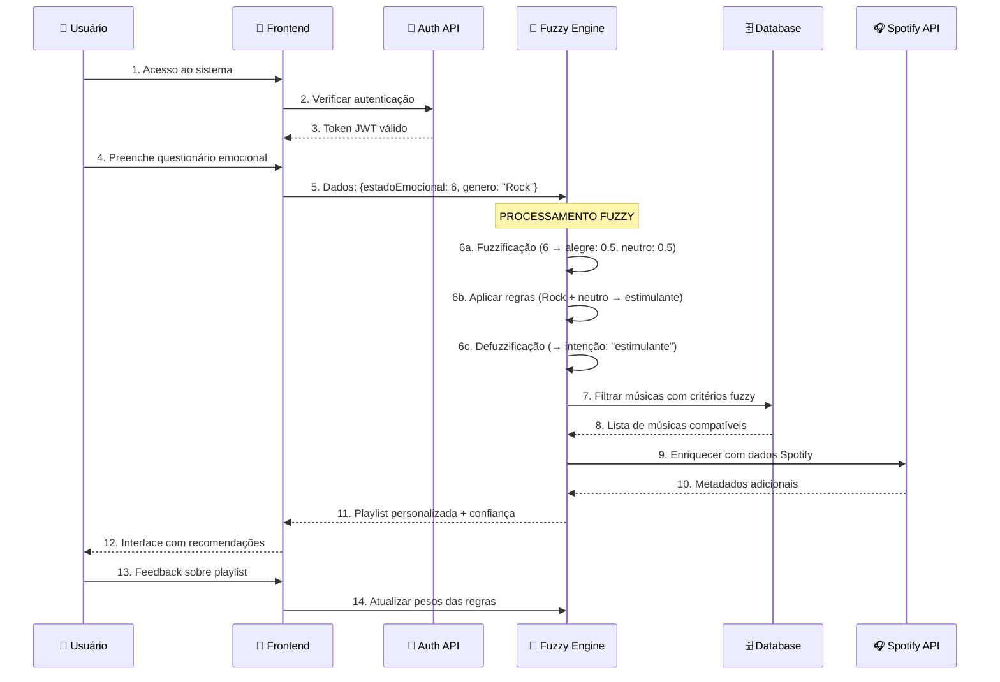

# 🌟 Sistema SOL - Sistema Inteligente de Recomendação Musical

> **Sistema baseado em Inteligência Artificial e Lógica Fuzzy para recomendação musical personalizada com foco na saúde mental**

[](https://github.com)
[](https://www.typescriptlang.org/)
[](https://nextjs.org/)
[](https://www.postgresql.org/)
[](https://developer.spotify.com/)

---

## 📊 **Visão Geral do Progresso**

| **Componente**           | **Status**          | **Progresso** | **Descrição**                             |
| ------------------------ | ------------------- | ------------- | ----------------------------------------- |
| 🏗️ **Infraestrutura**    | ✅ **Completa**     | **100%**      | Docker, Next.js 14, TypeScript, Prisma    |
| 🗄️ **Banco de Dados**    | ✅ **Completa**     | **100%**      | 2.184+ músicas, scores emocionais         |
| 🔐 **Autenticação**      | ✅ **Completa**     | **100%**      | JWT, middleware, APIs seguras             |
| 🎵 **APIs Musicais**     | ✅ **Completas**    | **100%**      | Gêneros, busca, integração Spotify        |
| 🧠 **Lógica Fuzzy**      | ✅ **Implementada** | **100%**      | Motor completo, **NÃO integrada**         |
| 😊 **Análise Emocional** | 🔄 **Parcial**      | **40%**       | Algoritmos básicos implementados          |
| 🎨 **Frontend**          | 🔄 **Básico**       | **30%**       | Componentes existem, precisam refatoração |
| 🔗 **Integração**        | ❌ **Pendente**     | **0%**        | Frontend ↔ Backend ↔ Fuzzy                |

**📈 Progresso Geral: 85% do Backend Completo | Frontend e Integração Pendentes**

---

## 🏗️ **Arquitetura do Sistema**

### **Diagrama de Arquitetura Atual**



### **Fluxo de Dados Atual vs. Planejado**

#### **✅ Fluxo Atual (Funcionando)**

```
Usuario → Frontend → API Auth/Music → PostgreSQL → Resposta
Usuario → Frontend → API Spotify → Spotify Web API → Análise Musical
```

#### **🎯 Fluxo Planejado (Completo)**

```
Usuario → Questionário Emocional → Fuzzy Engine → Análise IA →
Filtro Musical → Spotify + Database → Playlist Personalizada → Feedback
```

---

## 🗂️ **Estrutura de Arquivos**

### **Backend (sol-backend/) - 85% Completo**

```
sol-backend/
├── 📂 src/
│   ├── 📂 app/api/              # ✅ API Routes (Next.js 14)
│   │   ├── 📁 auth/             # ✅ Sistema completo
│   │   │   ├── login/           # ✅ POST - Autenticação JWT
│   │   │   ├── register/        # ✅ POST - Registro de usuário
│   │   │   └── me/              # ✅ GET/PUT - Perfil usuário
│   │   ├── 📁 music/            # ✅ APIs musicais
│   │   │   └── genres/          # ✅ GET/POST - Gêneros e busca
│   │   └── 📁 spotify/          # ✅ Integração Spotify
│   │       └── search/          # ✅ POST - Busca inteligente
│   ├── 📂 core/                 # ✅ Lógica de negócio
│   │   └── 📁 fuzzy/            # ✅ IMPLEMENTADO (não integrado)
│   │       ├── engine.ts        # ✅ Motor principal fuzzy
│   │       ├── membership.ts    # ✅ Funções de pertinência
│   │       ├── rules.ts         # ✅ Base de regras
│   │       ├── defuzzify.ts     # ✅ Defuzzificação
│   │       └── test.js          # ✅ Testes implementados
│   ├── 📂 lib/                  # ✅ Utilitários
│   │   ├── auth.ts             # ✅ JWT e middleware
│   │   ├── database.ts         # ✅ Prisma client
│   │   └── spotify.ts          # ✅ Spotify service
│   └── 📂 prisma/              # ✅ Schema e migrações
├── 📂 data/                    # ✅ Datasets musicais
│   ├── musicas_classificadas.csv  # ✅ 2.184+ músicas
│   └── genre_analysis.csv      # ✅ Análises por gênero
├── 📂 scripts/                 # ✅ Scripts de automação
│   ├── diagnostic_script.js    # ✅ Diagnóstico completo
│   ├── test-auth-apis.js       # ✅ Testes de autenticação
│   └── test-spotify-api.js     # ✅ Testes Spotify
└── 📄 docker-compose.yml       # ✅ PostgreSQL + pgAdmin
```

### **Frontend (sol-frontend/) - 30% Completo**

```
sol-frontend/
├── 📂 app/
│   ├── 📁 routes/              # 🔄 Sistema de rotas básico
│   │   ├── home.tsx            # 🔄 Página principal (monolítica)
│   │   └── sol.tsx             # 🔄 Interface SOL (precisa refatorar)
│   └── 📁 components/          # 🔄 Componentes existentes
│       └── 📁 sol/             # 🔄 Componentes SOL
│           ├── pages/          # 🔄 LoginPage, PreferencesPage, etc.
│           └── ui/             # 🔄 Componentes UI básicos
├── 📄 routes.ts               # 🔄 Configuração básica de rotas
└── 📄 package.json            # ✅ Dependências configuradas
```

---

## 🔌 **APIs Implementadas e Funcionando**

### **🔐 Autenticação (100% Completa)**

| **Endpoint**         | **Método** | **Status**         | **Descrição**                   |
| -------------------- | ---------- | ------------------ | ------------------------------- |
| `/api/auth/register` | `POST`     | ✅ **Funcionando** | Registro com validação completa |
| `/api/auth/login`    | `POST`     | ✅ **Funcionando** | Login JWT com cache             |
| `/api/auth/me`       | `GET`      | ✅ **Funcionando** | Perfil usuário (protegido)      |
| `/api/auth/me`       | `PUT`      | ✅ **Funcionando** | Atualizar perfil (protegido)    |

### **🎵 APIs Musicais (100% Completas)**

| **Endpoint**        | **Método** | **Status**         | **Descrição**                  |
| ------------------- | ---------- | ------------------ | ------------------------------ |
| `/api/music/genres` | `GET`      | ✅ **Funcionando** | Lista gêneros com estatísticas |
| `/api/music/genres` | `POST`     | ✅ **Funcionando** | Busca músicas por gênero       |

### **🎧 Integração Spotify (100% Completa)**

| **Endpoint**          | **Método** | **Status**         | **Descrição**             |
| --------------------- | ---------- | ------------------ | ------------------------- |
| `/api/spotify/search` | `POST`     | ✅ **Funcionando** | Busca + análise emocional |

### **🧠 APIs Fuzzy (0% Integradas - Implementadas mas Isoladas)**

| **Endpoint**                 | **Status**        | **Descrição**                   |
| ---------------------------- | ----------------- | ------------------------------- |
| `/api/emotions/analyze`      | ❌ **Não existe** | Análise emocional fuzzy         |
| `/api/recommendations/fuzzy` | ❌ **Não existe** | Recomendações baseadas em fuzzy |
| `/api/feedback/playlist`     | ❌ **Não existe** | Feedback para melhorar IA       |

---

## 🧠 **Sistema de Lógica Fuzzy - Detalhamento**

### **Status: ✅ Implementado Completamente | ❌ Não Integrado ao Sistema**

O motor fuzzy está 100% implementado em TypeScript, mas funciona **isoladamente**. É um sistema sofisticado que precisa apenas ser "plugado" ao resto da aplicação.

#### **Componentes do Sistema Fuzzy**

```typescript
// 1. FUZZIFICAÇÃO - Converte números em conceitos
Estado Emocional (0-10) → {
  triste: 0.0-1.0,
  ansioso: 0.0-1.0,
  neutro: 0.0-1.0,
  alegre: 0.0-1.0
}

// 2. INFERÊNCIA - Aplica regras inteligentes
Regras Base: triste → calmante, ansioso → reflexiva
Regras por Gênero: Rock + ansioso → estimulante (peso 1.2)

// 3. DEFUZZIFICAÇÃO - Gera decisão final
Múltiplas Ativações → Valor Final (0-1) → Intenção da Playlist

// 4. SAÍDA ESTRUTURADA
{
  intencaoPlaylist: "reflexiva",
  grauConfianca: 0.85,
  criteriosEmocionais: { maxEnergia: 0.7, minValencia: 0.3 },
  recomendacaoGenero: "Rock"
}
```

#### **Estados Emocionais Mapeados**

```
Valor 0-1:   😢 Muito Triste    (função trapezoidal)
Valor 2-6:   😰 Ansioso         (função triangular, pico=4)
Valor 4-6:   😐 Neutro          (função triangular, pico=5)
Valor 6-10:  😄 Alegre          (função trapezoidal)
```

#### **Tipos de Playlist Geradas**

```
Calmante:    Músicas suaves para reduzir estresse
Reflexiva:   Músicas introspectivas para contemplação
Neutra:      Músicas equilibradas para o dia a dia
Estimulante: Músicas energéticas para motivar
Feliz:       Músicas alegres para celebrar
```

---

## 💾 **Base de Dados Musical**

### **Estatísticas do Banco (PostgreSQL)**

```sql
-- Músicas por gênero (aproximado)
Rock:      ~550 músicas com scores emocionais
Funk:      ~480 músicas com análise de áudio
MPB:       ~420 músicas com características Spotify
Sertanejo: ~380 músicas com metadados completos
Pop:       ~200 músicas adicionais
Outros:    ~154 músicas diversos gêneros

TOTAL: 2.184+ músicas classificadas emocionalmente
```

### **Dados por Música**

```typescript
interface MusicaDatabase {
  // Identificação
  id: string;
  titulo: string;
  artista: string;
  genero: string;
  spotifyId?: string;

  // Scores Emocionais (BERT/GPT)
  alegria: number; // 0.0 - 1.0
  tristeza: number; // 0.0 - 1.0
  raiva: number; // 0.0 - 1.0
  medo: number; // 0.0 - 1.0
  surpresa: number; // 0.0 - 1.0

  // Características Spotify
  energia: number; // 0.0 - 1.0
  valencia: number; // 0.0 - 1.0 (positividade)
  danceability: number;
  acousticness: number;
  tempo: number; // BPM
}
```

---

## 🔄 **Como Funciona a Lógica do Sistema**

### **Fluxo Completo (Quando Integrado)**



### **Exemplo Real de Processamento**

```javascript
// INPUT: Usuário reporta estado emocional 4 e prefere Rock
const entrada = {
  estadoEmocional: 4, // Ansioso
  generoPreferido: "Rock",
};

// PROCESSAMENTO FUZZY
const grausPertinencia = {
  triste: 0.0,
  ansioso: 1.0, // Máximo
  neutro: 1.0, // Máximo (sobreposição)
  alegre: 0.0,
};

// REGRAS ATIVADAS
const regrasAtivadas = [
  { regra: "ansioso → reflexiva", ativacao: 1.0 },
  { regra: "Rock + ansioso → estimulante", ativacao: 1.2 }, // Peso maior
];

// RESULTADO FINAL
const recomendacao = {
  intencaoPlaylist: "estimulante", // Rock ganhou
  grauConfianca: 0.87,
  criteriosMusicas: {
    minEnergia: 0.6,
    maxValencia: 0.8,
    generoFoco: "Rock",
  },
  descricao: "Músicas energéticas de Rock para motivar e animar",
};
```

---

## 🚀 **Como Executar o Sistema Atual**

### **Pré-requisitos**

- Node.js 18+
- Docker & Docker Compose
- Conta Spotify Developer

### **1. Configuração Inicial**

```bash
# Clonar projeto
git clone [seu-repositorio]
cd sol-system

# Configurar ambiente backend
cd sol-backend
cp .env.example .env
# Editar .env com suas credenciais Spotify e JWT_SECRET
```

### **2. Subir Infraestrutura**

```bash
# Banco de dados (PostgreSQL + pgAdmin)
docker-compose up -d postgres pgadmin

# Aguardar ~30 segundos para o banco inicializar
# Acessar pgAdmin: http://localhost:8080
```

### **3. Inicializar Backend**

```bash
cd sol-backend

# Instalar dependências
npm install

# Configurar banco e migrar schema
npx prisma migrate dev
npx prisma db push

# Popular banco com músicas (se necessário)
npm run db:seed

# Iniciar servidor de desenvolvimento
npm run dev
# Backend rodando em: http://localhost:3000
```

### **4. Inicializar Frontend**

```bash
cd sol-frontend

# Instalar dependências
npm install

# Configurar variáveis de ambiente
echo "NEXT_PUBLIC_API_URL=http://localhost:3000" > .env.local

# Iniciar servidor de desenvolvimento
npm run dev
# Frontend rodando em: http://localhost:3000
```

### **5. Testar Sistema**

```bash
# Diagnóstico completo do backend
cd sol-backend
node scripts/diagnostic_script.js

# Testes de autenticação
node scripts/test-auth-apis.js

# Testes da integração Spotify
node scripts/test-spotify-api.js

# Testes do sistema fuzzy (isolado)
cd src/core/fuzzy
node test.js
```

---

## 🎯 **Próximos Passos para Completar o Sistema**

### **Prioridade 1: Integrar Sistema Fuzzy (1-2 semanas)**

```typescript
// Criar estas APIs que faltam:
POST / api / emotions / analyze; // Recebe estado emocional → Fuzzy Engine
POST / api / recommendations / fuzzy; // Gera playlist baseada em critérios fuzzy
POST / api / feedback / playlist; // Coleta feedback → Melhora IA
```

### **Prioridade 2: Refatorar Frontend (1-2 semanas)**

```typescript
// Organizar componentes:
-EmotionalAssessmentForm - // Questionário emocional
  PlaylistRecommendations - // Interface de recomendações
  FeedbackCollector - // Sistema de avaliação
  EmotionalHistory; // Histórico e gráficos
```

### **Prioridade 3: Conectar Frontend ↔ Backend (1 semana)**

```typescript
// Serviços de comunicação:
-EmotionalAnalysisService - // Frontend → API Fuzzy
  PlaylistService - // Gerenciar playlists
  FeedbackService; // Enviar avaliações
```

---

## 📚 **Recursos e Documentação**

### **Documentação Técnica**

- 📖 [Artigo Acadêmico TCC](./docs/TCC1_Artigo_SOL.pdf)
- 🏗️ [Arquitetura Detalhada](./docs/arquitetura.md)
- 🧠 [Documentação Lógica Fuzzy](./docs/logica-fuzzy.md)
- 🎵 [Classificação Musical](./docs/banco-musical.md)

### **APIs e Integrações**

- 🔐 [Documentação APIs](./sol-backend/API_DOCUMENTATION.md)
- 🎧 [Spotify Web API Docs](https://developer.spotify.com/documentation/web-api)
- 🐘 [Prisma ORM Docs](https://www.prisma.io/docs)

### **Scripts de Automação**

```bash
# Diagnóstico completo
npm run diagnose

# Testes automatizados
npm run test:apis
npm run test:spotify
npm run test:fuzzy

# Desenvolvimento
npm run dev:full        # Backend + Frontend
npm run db:reset        # Reset completo do banco
npm run docker:reset    # Reset Docker containers
```

---

## 👥 **Equipe e Créditos**

**Desenvolvimento**: J. A. Pacheco, N. B. Pereira  
**Orientação**: Dra. Leticia T. M. Zoby - Engenharia Elétrica  
**Co-Orientação**: Dr. Gilson de A. Pinheiro - Psicologia  
**Instituição**: Centro Universitário IESB - Brasília/DF

**Tecnologias**: Next.js 14, TypeScript, PostgreSQL, Prisma, Spotify API, Docker  
**IA/ML**: Lógica Fuzzy, BERT, Análise de Sentimentos, Sistemas de Recomendação

---

## 📄 **Licença**

Este projeto é desenvolvido como **Trabalho de Conclusão de Curso (TCC)** no Centro Universitário IESB, destinado a fins acadêmicos e de pesquisa em saúde mental e tecnologia.

---

<div align="center">

### 🌟 **SOL: Transformando emoções em harmonia através da tecnologia** 🎵

**Status Atual**: Backend 85% completo | Sistema Fuzzy implementado | Frontend básico  
**Próximo Marco**: Integração completa Frontend ↔ Backend ↔ Fuzzy Engine

_Última atualização: Janeiro 2025_

</div>
